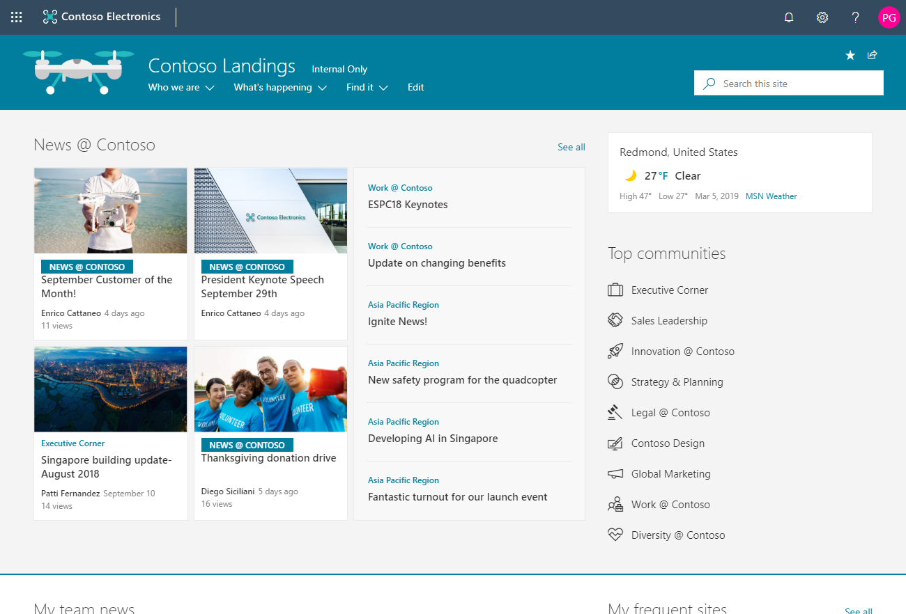
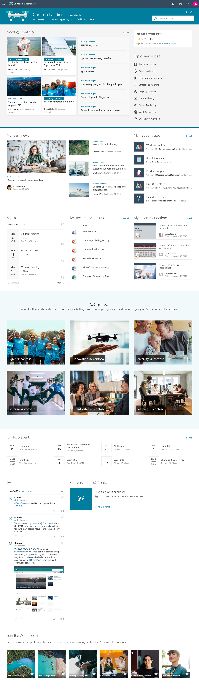

# Contoso Drone Landing Site

This is the modern way of building a welcome site leveraging the communication site template and many webparts.

The welcome page brings together example news, events and other content to demonstrate the possible information you can bring together in SharePoint Online.

You can also further extend the experiences by adding custom web parts, adjusting the layout and adding more page content.

## Template content

Template contains following structures and assets:

- New site collection using communication site template, unless applied on top of existing site
- Custom welcome page
- 10 news articles with example content
- Sample PDF files in the Documents library
- Sample image content used in the template

**Notice** - If applied on top of existing communication site, welcome page content will be overridden.

## Full layout

Below picture shows the expected layout from this template.

**Note** - There might be small differences between the screenshot from the [SharePoint look book](https://spdesign.azurewebsites.net) and the end results of the template. Template automation will get you as close as possible given certain API level limitations. Templates are also designed to be as independent as possible, which has resulted some compromises on the implementation.

## Prerequisites

Here are current prerequisites for making this solution work in your tenant.

- You will need to be a tenant administrator to be able to deploy this solution
    - Notice that you can get free developer tenant from [Office 365 developer program](https://developer.microsoft.com/en-us/office/dev-program), if needed
- Automatic end-to-end provisioning only works with English tenants
    - All solutions and web parts are also English in the current implementation