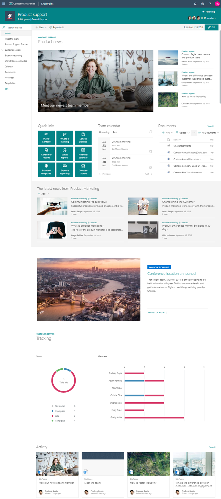

# Contoso Team Site

This template is quite complex template with some example content for enabling collaboration in team site level.

Notice that you can easily extend the initially provisioned site for example by doing following modifications:

- Include product or company news directly on the team site welcome page from the hub sites
- Include discussions and other web parts on the page based on your requirements

## Pre-requirements

Here are current pre-requirements for making this solution work in your tenant.

- You will need to be a tenant administrator to be able to deploy this solution
    - Notice that you can get free developer tenant from [Office 365 developer program](https://developer.microsoft.com/en-us/office/dev-program), if needed
- Automatic end-to-end provisioning only works with English tenants
    - All solutions and web parts are also English in the current implementation
- A tenant 'App Catalog' must have been created within the 'Apps' option of the SharePoint Admin Center

