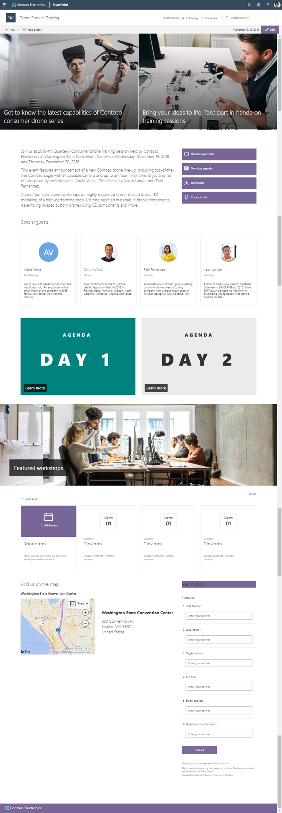

# Contoso Workshop Template

This template is designed to demonstrate how a generic workshop centric site could look like in SharePoint Online.

This site could be associated to a workshops hub site to aggregate workshop information from multiple workshops.

Notice that you can easily extend the initially provisioned site for example by doing following modifications:

- Include registration web part using PowerApps (not present by default)
- Include Yammer discussion web part for enablign attendees to discuss the workshop even before it happens

**Note** - There might be small differences between the screenshot from the [SharePoint look book](https://spdesign.azurewebsites.net) and the end results of the template. Template automation will get you as close as possible given certain API level automation. Templates are also designed to be as independent as possible, which has resulted some compromises on the implementation.

## Prerequisites

Here are current prerequisites for making this solution work in your tenant.

- You will need to be a tenant administrator to be able to deploy this solution
    - Notice that you can get free developer tenant from [Office 365 developer program](https://developer.microsoft.com/en-us/office/dev-program), if needed
- Automatic end-to-end provisioning only works with English tenants
    - All solutions and web parts are also English in the current implementation
- A tenant 'App Catalog' must have been created within the 'Apps' option of the SharePoint Admin Center

