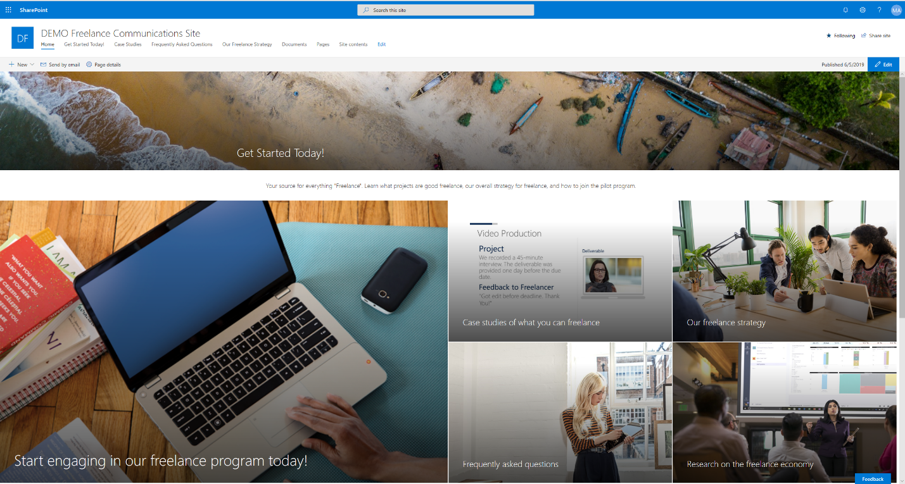

# Microsoft 365 freelance toolkit

If you’re working with freelancers or running a freelancer program in your organization, the Microsoft 365 freelance toolkit template provides a great starting point for driving awareness, increasing engagement, and streamlining communication flow with your internal stakeholders and freelancers.  The Microsoft 365 freelance toolkit template is a SharePoint Online communication site template that you can install in your organization and easily customize to jump-start your freelance program efforts. Once installed and customized, your organization has a single place on the intranet for your team, department, or division to gather and track data, keep everyone up to date with news, tasks and deadlines, and connect everyone to all the resources they need across Office 365.  

The Microsoft 365 freelance toolkit provides a wealth of resources you can use get your employees up to speed quickly on your freelance initiatives and projects. Imagine, a single location on your intranet with ready-to-go FAQs on working with freelancers, best practices for engaging with external talent, along with case studies and research on industry trends with the gig economy and how gig economy concerns are being addressed across the globe. 

## Template content

Template contains following structures and assets:

- Welcome page
- 5 additional content pages
- Sample PowerPoint file in Documents folder
- Sample image content used in the template

**For complete Microsoft 365 freelance toolkit documentation, go to http://aka.ms/freelancetoolkit.**

## Prerequisites

Here are current prerequisites for making this solution work in your tenant.

- You will need to be a tenant administrator to be able to deploy this solution to the target tenant
  - If needed, you can get free a developer tenant from the Office 365 developer program  
- Automatic end-to-end provisioning only works with English tenants  
  - All solutions and web parts are also English in the current implementation
