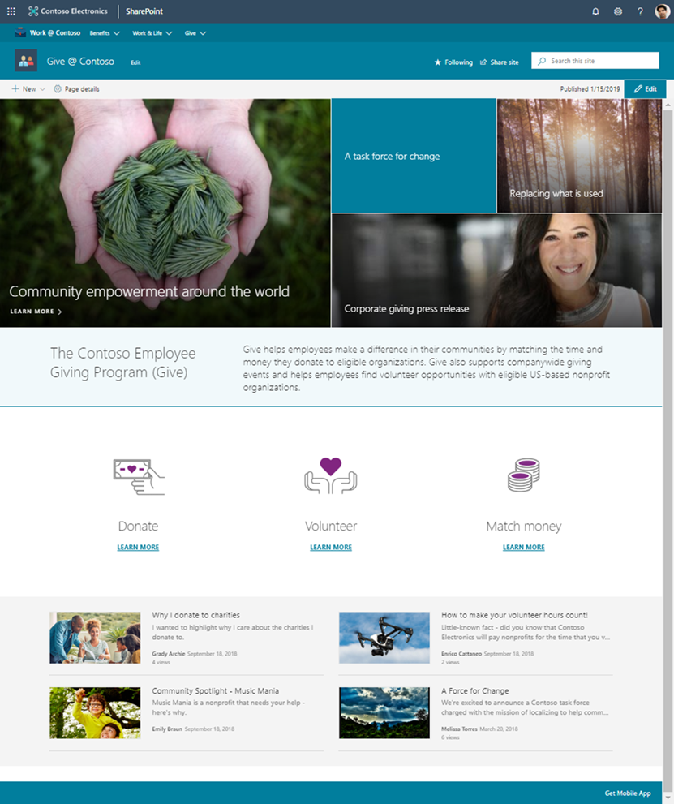

# Give @ Contoso

This template is designed to demonstrate how a typical company charity site could look like in the SharePoint Online. It has a relatively simple structure with some example page and content to get you started on updating the template based on your specific requirements.

This site could be associated to the enterprise or divisional hub site, so that it's sharing main navigation with the other related sites in single consistent information architecture.

## Pre-requirements

Here are current pre-requirements for making this solution work in your tenant.

- You will need to be a tenant administrator to be able to deploy this solution
    - Notice that you can get free developer tenant from [Office 365 developer program](https://developer.microsoft.com/en-us/office/dev-program), if needed
- Automatic end-to-end provisioning only works with English tenants
    - All solutions and web parts are also English in the current implementation
- A tenant 'App Catalog' must have been created within the 'Apps' option of the SharePoint Admin Center

