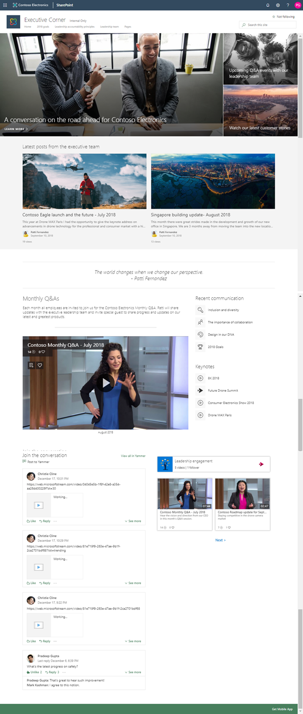

# Leadership

This template is designed to demonstrate how a company executive information site could look like in SharePoint Online. It has a relatively simple structure with some example pages and contents to get you started on updating the template based on your specific requirements.

This site could be associated to an enterprise or divisional hub site, so that it is sharing the main navigation with the other related sites in single consistent information architecture.

Notice that you can easily extend the initially provisioned site for example by doing following modifications:

- Include Stream web parts with videos (not present by default)
- Include Yammer web part, if in use, for discussions (not present by default)
- Include company mission and latest leadership meeting documents on the front page

**Note** - There might be small differences between the screenshot from the [SharePoint look book](https://spdesign.azurewebsites.net) and the end results of the template. Template automation will get you as close as possible given certain API level limitations. Templates are also designed to be as independent as possible, which has resulted some compromises on the implementation.

## Prerequisites

Here are current prerequisites for making this solution work in your tenant.

- You will need to be a tenant administrator to be able to deploy this solution
    - Notice that you can get free developer tenant from [Office 365 developer program](https://developer.microsoft.com/en-us/office/dev-program), if needed
- Automatic end-to-end provisioning only works with English tenants
    - All solutions and web parts are also English in the current implementation
- A tenant 'App Catalog' must have been created within the 'Apps' option of the SharePoint Admin Center
