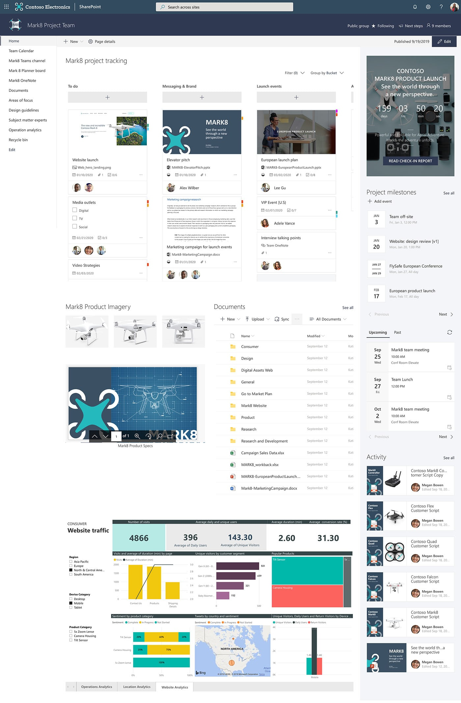

# Mark8 Project Team

This sites illustrates the use of a custom search result page. When searching from the navigation bar search box, you are redirected to a custom search result page, showing search results from within the current site using custom templating.

## Template content

Template contains following structures and assets:

- Custom search results page using PnP Modern Search web parts
- Complex welcome page with out-of-the-box web parts
- Example images and Office documents

**Notice** - If applied on top of existing communication site, welcome page content will be overridden.

## Full layout

Below picture shows the expected layout from this template.

**Note** - There might be small differences between the screenshot from the [SharePoint look book](https://spdesign.azurewebsites.net) and the end results of the template. Template automation will get you as close as possible given certain API level limitations. Templates are also designed to be as independent as possible, which has resulted some compromises on the implementation.

## Prerequisites

Here are current prerequisites for making this solution work in your tenant.

- You will need to be a tenant administrator to be able to deploy this solution to the target tenant
- Automatic end-to-end provisioning has only been tested with English tenants
- A tenant 'App Catalog' must have been created within the 'Apps' option of the SharePoint Admin Center and you must be one of the site collection admins of the 'App Catalog' site collection
