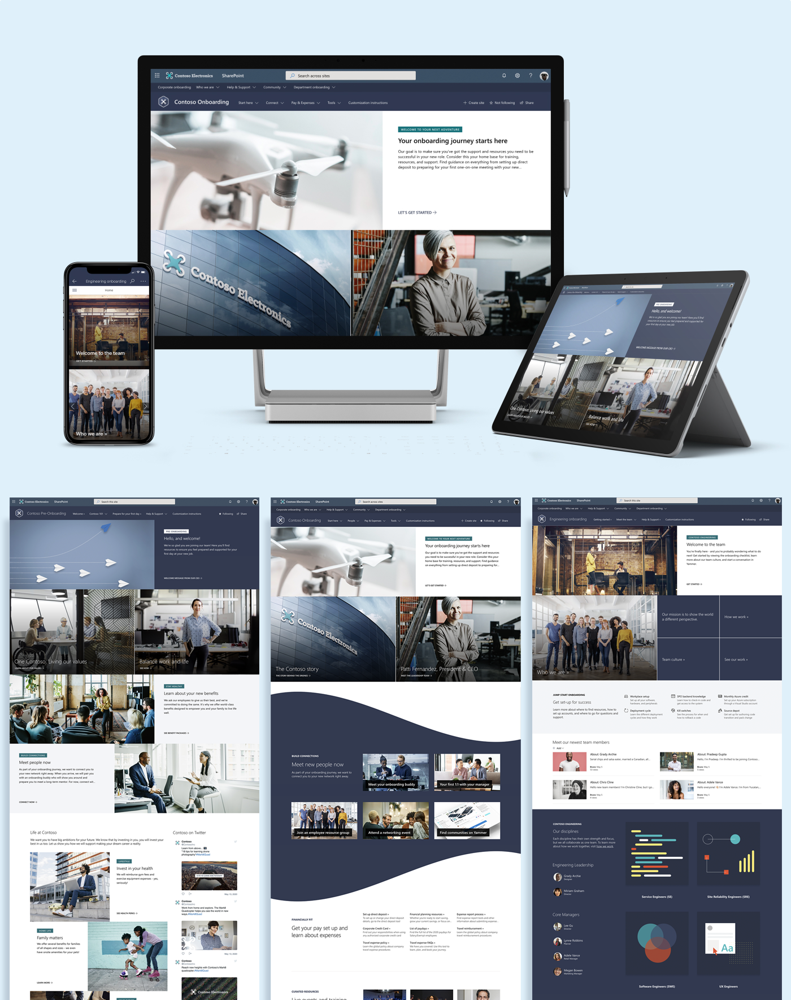

# New Employee Onboarding Hub

Streamline and refine your new employee onboarding process with pre-built templates that cover Pre-onboarding, Corporate-level onboarding, and Departmental-level onboarding scenarios. This digital solution offers 4 different site templates that contain pre-populated content that can be customized to align with the goals of your organization.  

New Employee Onboarding provides:

- Pre-onboarding site, Corporate onboarding site, and two Departmental onboarding sites
- Custom and pre-populated home pages for each site
- Configured hub site for Corporate onboarding and associated sites for Departmental onboarding
- New employee checklist built on SharePoint Lists to help new hires onboard successfully
- Example content for the People web part, Yammer web part, News web part, and Quick links web part
- Pre-written FAQs for each site
- Recommendations for creating social and engaging experiences, like including a welcome video using the YouTube web part on the Pre-onboarding site

**For complete New Employee Onboarding documentation, go to https://docs.microsoft.com/sharepoint/provision-neo-hub.**

## Prerequisites

Here are current prerequisites for making this solution work in your tenant.

- You will need to be a tenant administrator to be able to deploy this solution to the target tenant
  - If needed, you can get free a developer tenant from the Office 365 developer program  
