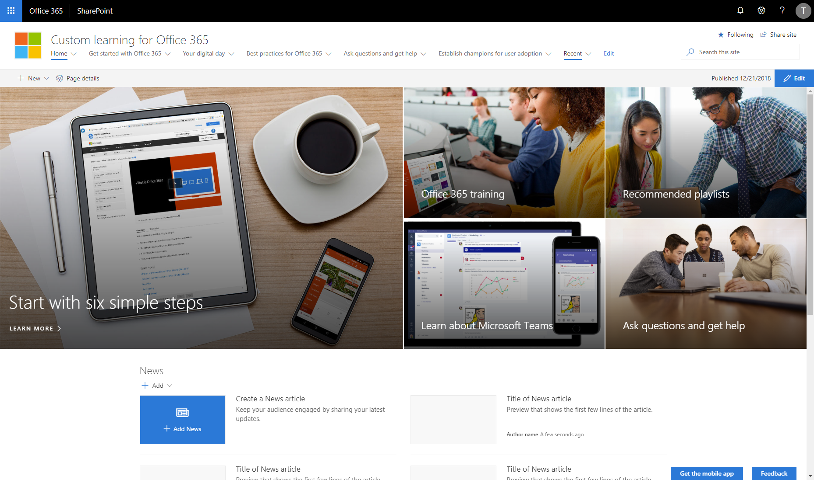

# Custom Learning for Office 365

Help your organization get more from Microsoft services by implementing the Custom Learning for Office 365 training portal. This digital, customizable learning solution streams on-demand content for Office 365 services and Windows 10 right to your end users.  The convenient playlist format allows employees to improve their skills on their timetable and at their pace.  The modern SharePoint Online site also allows you to add your own content to create a complete modern training portal.  

Custom Learning for Office 365 solves these problems by delivering: 

- **Customizable, flexible content** – Site administrators choose to hide or show content based on their environment or build their own custom playlists that are tailored to the unique needs of their organization. End users make their own playlists and share them with coworkers.
- **Flexible solutions** – Our service offers training playlist tools to be incorporated within their existing sites or the full modern portal experience which can provide the end to end out of the box website for customizable adoption & training content. 
- **Always up-to-date content** - Our content is continually and automatically updated, enabling organizations to provide a library of up-to-date learning content for end users and avoid the hassle of having to make the changes themselves.
- **Measurement tools** – Organizations gain valuable insights into the training materials employees consume and the types of custom playlists they create and share.

Complete documentation for our solution can be found on our service information pages located at [https://aka.ms/CLO365Docs](https://aka.ms/CLO365Docs).  

## Prerequisites

Here are current prerequisites for making this solution work in your tenant.

- You will need to be a tenant administrator to be able to deploy this solution to the target tenant
    - Notice that, if needed, you can get free developer tenant from [Office 365 developer program](https://developer.microsoft.com/en-us/office/dev-program)
- Automatic end-to-end provisioning only works with English tenants
    - All solutions and web parts are also English in the current implementation
- A tenant 'App Catalog' must have been created within the 'Apps' option of the SharePoint Admin Center and you have to be one of the site collection admins of the 'App Catalog' site collection

