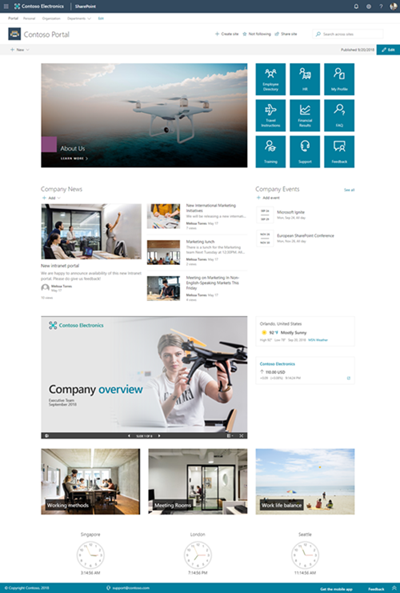
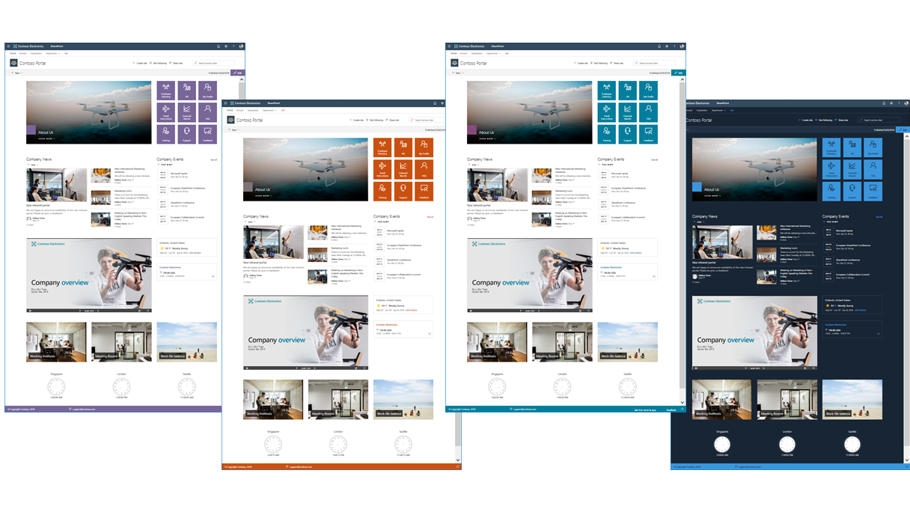

# SharePoint Starter Kit

This is a sample solution designed for SharePoint Online which provides numerous web parts, extensions, and other components which you can use as an example and inspiration for your own customizations.

SharePoint Starter Kit is provided as an open-source solution for anyone to benefit from overall design or from code perspective. You can find all used assets from the [sp-starter-kit GitHub repository](https://github.com/SharePoint/sp-starter-kit).

**Note.** please check the Prerequisites section later in this page, before trying to apply this to your demo tenant. Notice also that this template does perform tenant wide configurations, so it's not recommended to be used in production tenants, unless you know what you are doing.

## Objectives of this solution

SharePoint Communication Sites have great out-of-the-box capabilities, but the out-of-the-box capabilities may not always be enough for your scenarios. This is exactly why you can include your own customizations. This solution addresses common scenarios and tasks you may encounter when introducing those customizations, and provides examples and guidance on how you might address them including:

- Automated provisioning of simple demo content within a communication site
- Automated provisioning of the whole solution to any tenant within minutes
- Automated configuration of Site Scripts and Site Designs at the tenant level using the PnP Remote Provisioning engine
- Implementation of different customizations for SharePoint Online
- Usage of Office UI Fabric and reusable PnP SPFx controls within the customizations

## Included customizations

SharePoint Starter Kit applies following sites:

- Creates 3 different site collections - landing hub site and two sub site collections associated on the hub site
- Installation of custom SharePoint Framework solution with 17 additional web parts and 7 SharePoint Framework extensions
- Custom Site Designs which are visible in the out-of-the-box site creation process
- Custom tenant themes, which are applied to the created site collections

## Prerequisites

Here are current prerequisites for making this solution work in your tenant.

- You will need to be a tenant administrator to be able to deploy this solution
    - Notice that you can get free developer tenant from [Office 365 developer program](https://developer.microsoft.com/en-us/office/dev-program), if needed.
- Automatic end-to-end provisioning only works with English tenants
    - All solutions and web parts are also English in the current implementation
    - For tenants that have English but have a different default language, the [term set provisioning may be modified to assist with installation](./documentation/term-store.md#non-english-tenants).
- Release preferences for your tenant will need to be set as "Targeted release for everyone" option (also known as First Release)
- Add used tenant administrator account as Term Store Administrator in the Taxonomy Term Store 
- The tenant app catalog must have been created

## Support for this template

If you have any issues or questions around this template, please use the [sp-starter-kit GitHub repository issue list](https://github.com/SharePoint/sp-starter-kit/issues). This is community supported template.
