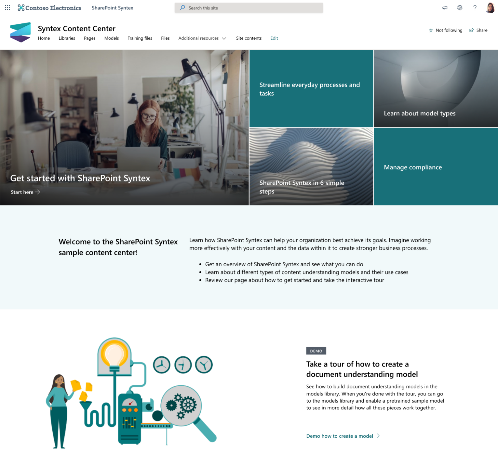

# SharePoint Syntex content center

## Content intelligence for everyone!
  
Use this site to learn more about SharePoint Syntex. We’ll introduce you to the tools you’ll need to create and train your own models. You can then use this site as a central content repository or as the control center for managing your own SharePoint Syntex models.

Models can be trained and evaluated using your own content. However, to apply the models to libraries, a license for SharePoint Syntex is required.

## Prerequisites

The person doing the provisioning must meet the following pre-requisites:

- Must be a tenant administrator of the tenant - also known as the Office 365 global administrator role - where the SharePoint Success Site will be provisioned.
- This template has limited functionality without a license. You can preview product capabilities and even train models. However, you will need to purchase a license to publish any models to libraries.

## What will be provisioned?

This template contains following elements which will be provisioned:

- A SharePoint Syntex Content Center site holding the SharePoint Syntex Content Center Site content

## Disclaimer

THIS CODE IS PROVIDED AS IS WITHOUT WARRANTY OF ANY KIND, EITHER EXPRESS OR IMPLIED, INCLUDING ANY IMPLIED WARRANTIES OF FITNESS FOR A PARTICULAR PURPOSE, MERCHANTABILITY, OR NON-INFRINGEMENT.
