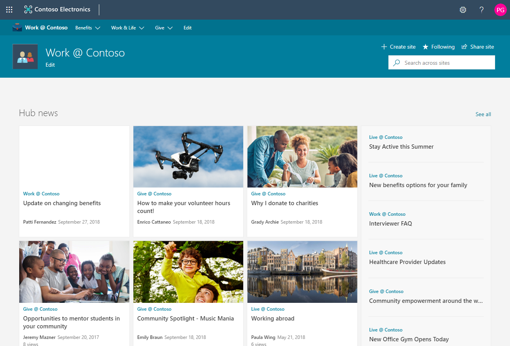
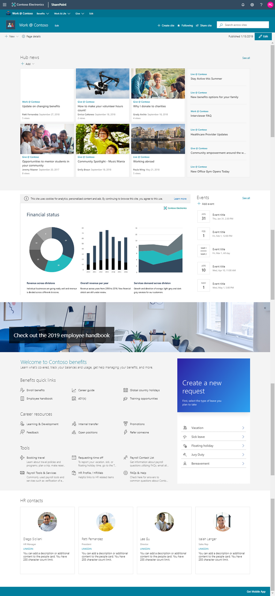

# Work

This template shows how a typical work-oriented hub site might look in SharePoint Online. It is designed to aggregate content and news from the associated site collections to show all relevant information from a single location.

The Work @ Contoso template consists of multiple site collections that are all automatically associated with the hub site to show how all default aggregation capabilities work.

The template also creates the hub navigation automatically with a sample information architecture, which you can easily modify and extend.

## Template content

The template contains following structures and assets:

- Main site collection set as a hub site
- Two communication sites associated with the hub site - Benefits and charity sites
- One group team site associated with the hub site - Team site
- Sample news articles in the subsite collections
- Sample Word, Excel, and PowerPoint files
- Sample image content used in the site collections

Subsite collections use the same templates, which you can also provision seperately from this service.

**Note:** If this template is applied on top of an existing communication site, the welcome page content will be overwritten.

## Full layout

The following picture shows the expected layout from this template.

**Note:** There might be small differences between the screenshot from the [SharePoint look book](https://spdesign.azurewebsites.net) and the end results of the template. Template automation will get you as close as possible given certain API-level limitations. Templates are also designed to be as independent as possible, which results in some compromises on the implementation.

## Prerequisites

The following are current prerequisites for making this solution work in your tenant:

- You will need to be a tenant administrator to deploy this solution.
    - You can get a free developer tenant by joining the [Office 365 developer program](https://developer.microsoft.com/en-us/office/dev-program).
- Automatic end-to-end provisioning only works with English tenants.
    - All solutions and web parts are also English in the current implementation.
