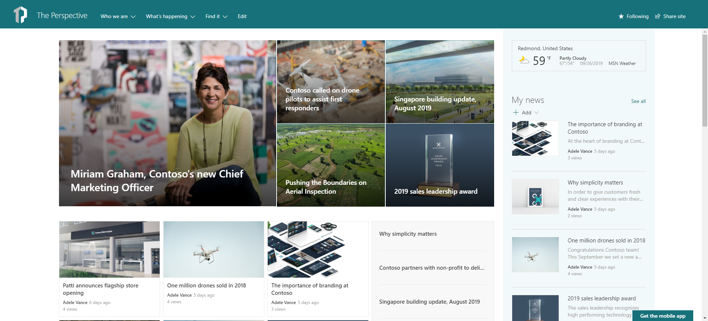

# The Perspective

It's THE Perspective!

You can easily extend the by doing following:

- Do some edits

## Template content

Template contains following structures and assets:

- TBD

**Notice** - If applied on top of existing communication site, welcome page content will be overridden.

## Full layout

Below picture shows the expected layout from this template.

**Note** - There might be small differences between the screenshot from the [SharePoint look book](https://spdesign.azurewebsites.net) and the end results of the template. Template automation will get you as close as possible given certain API level limitations. Templates are also designed to be as independent as possible, which has resulted some compromises on the implementation.

## Prerequisites

Here are current prerequisites for making this solution work in your tenant.

- You will need to be a site collection administrator to be able to deploy this solution with permissions to create new site collections, unless you apply it on top of an existing site
- Automatic end-to-end provisioning has only be tested with English tenants
